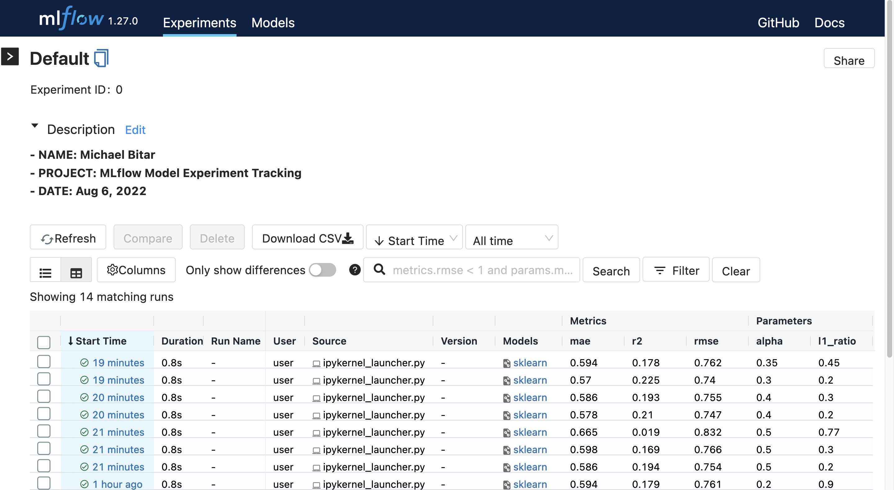
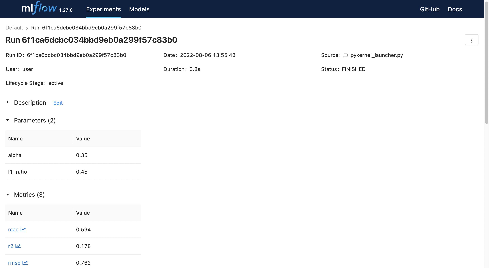
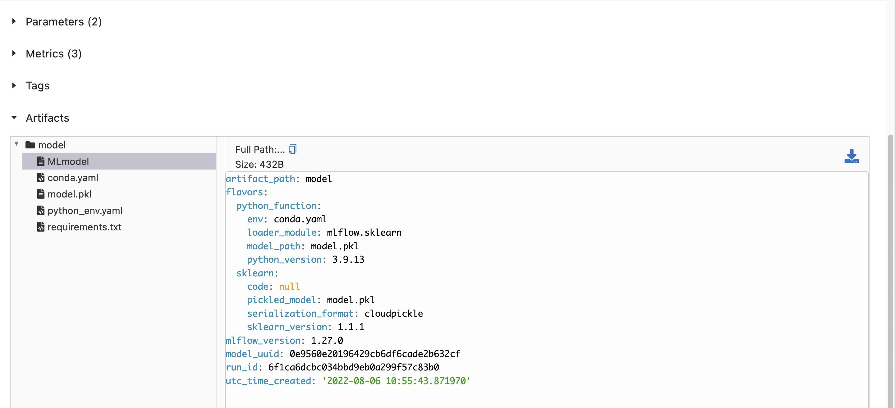

# Deploy MLFlow To Your Local Workstation and Track Your ML Experiments

## By Michael Bitar


This is a getting started guide to help deploy MLflow locally on a Macbook. 


If you are a machine learning developer like me, you typically spend most of your time experimenting with parameters and code on your local workstation using your favorite IDE or Jupyter Notebooks. In the past, I would use a spreadsheet to track my ML experiments. That was not fun.

The ML stack was begging for a toolchain that can bring DevOps-like functionality to ML development.  This led to the rise of tools referred to loosely as MLOps tools. One of those tools that's gaining traction is MLflow.

MLflow is an open source framework to help organize machine learning development workflows by tracking experiments, packaging code into reproducible executions, facilitating collaboration, and deploying models. 

MLflow can be deployed in many configurations. If you are developing locally most of the time and don't have the need for a central repo MLflow can be installed locally on your laptop so you can track your experiments and never have to guess again if you tried certain parameters or not and what was the resulting ML model performance. 

In this guide I will walk you thru how I deployed MLflow on my local macbook. Later, I will publish guides on more advanced setups such as using a cloud-hosted resources to support team collaboration and for higher availability, scalability, and security. 

LET'S GET STARTED! You can use this Jupyter Notebook as your starting point. Make sure you have access to the internet. 


```python
# Install mlflow

!pip install mlflow
```

    Requirement already satisfied: mlflow in /Users/user/miniforge3/lib/python3.9/site-packages (1.27.0)
    Requirement already satisfied: numpy in /Users/user/miniforge3/lib/python3.9/site-packages (from mlflow) (1.22.4)
    Requirement already satisfied: scipy in /Users/user/miniforge3/lib/python3.9/site-packages (from mlflow) (1.9.0)
    Requirement already satisfied: alembic in /Users/user/miniforge3/lib/python3.9/site-packages (from mlflow) (1.8.1)
    Requirement already satisfied: databricks-cli>=0.8.7 in /Users/user/miniforge3/lib/python3.9/site-packages (from mlflow) (0.17.0)
    Requirement already satisfied: gitpython>=2.1.0 in /Users/user/miniforge3/lib/python3.9/site-packages (from mlflow) (3.1.27)
    Requirement already satisfied: sqlalchemy>=1.4.0 in /Users/user/miniforge3/lib/python3.9/site-packages (from mlflow) (1.4.39)
    Requirement already satisfied: importlib-metadata!=4.7.0,>=3.7.0 in /Users/user/miniforge3/lib/python3.9/site-packages (from mlflow) (4.12.0)
    Requirement already satisfied: gunicorn in /Users/user/miniforge3/lib/python3.9/site-packages (from mlflow) (20.1.0)
    Requirement already satisfied: packaging in /Users/user/miniforge3/lib/python3.9/site-packages (from mlflow) (21.3)
    Requirement already satisfied: pandas in /Users/user/miniforge3/lib/python3.9/site-packages (from mlflow) (1.4.3)
    Requirement already satisfied: sqlparse>=0.3.1 in /Users/user/miniforge3/lib/python3.9/site-packages (from mlflow) (0.4.2)
    Requirement already satisfied: pytz in /Users/user/miniforge3/lib/python3.9/site-packages (from mlflow) (2022.1)
    Requirement already satisfied: docker>=4.0.0 in /Users/user/miniforge3/lib/python3.9/site-packages (from mlflow) (5.0.3)
    Requirement already satisfied: click>=7.0 in /Users/user/miniforge3/lib/python3.9/site-packages (from mlflow) (8.1.3)
    Requirement already satisfied: prometheus-flask-exporter in /Users/user/miniforge3/lib/python3.9/site-packages (from mlflow) (0.20.3)
    Requirement already satisfied: entrypoints in /Users/user/miniforge3/lib/python3.9/site-packages (from mlflow) (0.4)
    Requirement already satisfied: Flask in /Users/user/miniforge3/lib/python3.9/site-packages (from mlflow) (2.2.1)
    Requirement already satisfied: pyyaml>=5.1 in /Users/user/miniforge3/lib/python3.9/site-packages (from mlflow) (6.0)
    Requirement already satisfied: protobuf>=3.12.0 in /Users/user/miniforge3/lib/python3.9/site-packages (from mlflow) (3.19.4)
    Requirement already satisfied: cloudpickle in /Users/user/miniforge3/lib/python3.9/site-packages (from mlflow) (2.1.0)
    Requirement already satisfied: querystring-parser in /Users/user/miniforge3/lib/python3.9/site-packages (from mlflow) (1.2.4)
    Requirement already satisfied: requests>=2.17.3 in /Users/user/miniforge3/lib/python3.9/site-packages (from mlflow) (2.28.1)
  ...
    Requirement already satisfied: itsdangerous>=2.0 in /Users/user/miniforge3/lib/python3.9/site-packages (from Flask->mlflow) (2.1.2)
    Requirement already satisfied: Werkzeug>=2.2.0 in /Users/user/miniforge3/lib/python3.9/site-packages (from Flask->mlflow) (2.2.1)
    Requirement already satisfied: Jinja2>=3.0 in /Users/user/miniforge3/lib/python3.9/site-packages (from Flask->mlflow) (3.1.2)
    Requirement already satisfied: setuptools>=3.0 in /Users/user/miniforge3/lib/python3.9/site-packages (from gunicorn->mlflow) (63.2.0)
    Requirement already satisfied: pyparsing!=3.0.5,>=2.0.2 in /Users/user/miniforge3/lib/python3.9/site-packages (from packaging->mlflow) (3.0.9)
    Requirement already satisfied: python-dateutil>=2.8.1 in /Users/user/miniforge3/lib/python3.9/site-packages (from pandas->mlflow) (2.8.2)
    Requirement already satisfied: prometheus-client in /Users/user/miniforge3/lib/python3.9/site-packages (from prometheus-flask-exporter->mlflow) (0.14.1)
    Requirement already satisfied: smmap<6,>=3.0.1 in /Users/user/miniforge3/lib/python3.9/site-packages (from gitdb<5,>=4.0.1->gitpython>=2.1.0->mlflow) (5.0.0)
    Requirement already satisfied: MarkupSafe>=2.0 in /Users/user/miniforge3/lib/python3.9/site-packages (from Jinja2>=3.0->Flask->mlflow) (2.1.1)


```python
# Import needed support libraries 

import os
import warnings
import sys

import pandas as pd
import numpy as np
from sklearn.metrics import mean_squared_error, mean_absolute_error, r2_score
from sklearn.model_selection import train_test_split
from sklearn.linear_model import ElasticNet
from urllib.parse import urlparse
import mlflow
import mlflow.sklearn
```


```python
import logging

# configure logging

logging.basicConfig(level=logging.WARN)
logger = logging.getLogger(__name__)
```


```python
# define evaluation metrics. In this case I will select RMSE, MAE, R2 scores

def eval_metrics(actual, pred):
    rmse = np.sqrt(mean_squared_error(actual, pred))
    mae = mean_absolute_error(actual, pred)
    r2 = r2_score(actual, pred)
    return rmse, mae, r2
```


```python
#configure warning logs
warnings.filterwarnings("ignore")

# set random seed to reproduce same results everytime 

np.random.seed(40)

# Load the sample dataset csv file from this URL
csv_url = (
    "http://archive.ics.uci.edu/ml/machine-learning-databases/wine-quality/winequality-red.csv"
)
try:
    data = pd.read_csv(csv_url, sep=";")
except Exception as e:
    logger.exception(
        "Unable to download training & test CSV, check your internet connection. Error: %s", e
    )
    
# Split the data into training and test sets using (0.75, 0.25) split.
train, test = train_test_split(data)

# The predicted column is "quality" which is a scalar from [3, 9]

train_x = train.drop(["quality"], axis=1)
test_x = test.drop(["quality"], axis=1)
train_y = train[["quality"]]
test_y = test[["quality"]]


```


```python
# Run below code cell multiple times each with a different alpha and l1_ratio numbers using 
# values between 0 and 1. Each run will be tracked and listed in the MLflow dashboard.
# We will be usng the ElasticNet model in this example. 

# ElasticNet link: https://scikit-learn.org/stable/modules/generated/sklearn.linear_model.ElasticNet.html

alpha =  .35 # change this value for each run. This is used to multiply penalty terms.
l1_ratio =  .45  # change this value for each run. This var is a penalty value.

# This example uses the ElasticNet model. 
# It's a linear regression model with combined L1 and L2 priors as regularizer

with mlflow.start_run():
    lr = ElasticNet(alpha=alpha, l1_ratio=l1_ratio, random_state=42)
    lr.fit(train_x, train_y)

    predicted_qualities = lr.predict(test_x)

    (rmse, mae, r2) = eval_metrics(test_y, predicted_qualities)

    print("Elasticnet model (alpha=%f, l1_ratio=%f):" % (alpha, l1_ratio))
    print("  RMSE: %s" % rmse)
    print("  MAE: %s" % mae)
    print("  R2: %s" % r2)
    
    # log vars of interest to be tracked and listed by MLflow
    mlflow.log_param("alpha", alpha)
    mlflow.log_param("l1_ratio", l1_ratio)
    mlflow.log_metric("rmse", rmse)
    mlflow.log_metric("r2", r2)
    mlflow.log_metric("mae", mae)

    tracking_url_type_store = urlparse(mlflow.get_tracking_uri()).scheme

    # Model registry does not work with file store
    if tracking_url_type_store != "file":

        # Register the model
        # There are other ways to use the Model Registry, which depends on the use case,
        # please refer to the doc for more information:
        # https://mlflow.org/docs/latest/model-registry.html#api-workflow
        mlflow.sklearn.log_model(lr, "model", registered_model_name="ElasticnetWineModel")
    else:
        mlflow.sklearn.log_model(lr, "model")


# for each run, above metrics will be saved in model's local directory where it will be picked up by MLflow
```

    Elasticnet model (alpha=0.350000, l1_ratio=0.450000):
      RMSE: 0.7616514499663437
      MAE: 0.5936841528680933
      R2: 0.17804834226795552


```python
# when done, open a terminal and go to your projects local working 
# directory and below command (withour hashtag)

# mlflow ui
```


```python
# from your browser, open the mflow dashboard using below url (withour hashtag)

# http://localhost:5000
        
# you should see a dashboard similar to the one in the image below but your content will vary.

```




```python
# when you click on one of the experiment (runs) you can see more details such as related artifacts
#  

```




```python
# you can also track artifact metadata such as model matadata 
```



mlflow is feature-packed. If you are not using an MLops tool, you can enjoy substantial gains in productivity by simply by using it's basic features. Once you feel comfortable with the basics, you can exapnd your MLflow deployment. 

My next MLops guide will cover remote MLflow deployment and touch on some of the tool's more advanced features to support cloud and team collaboration. 

Thank you.
